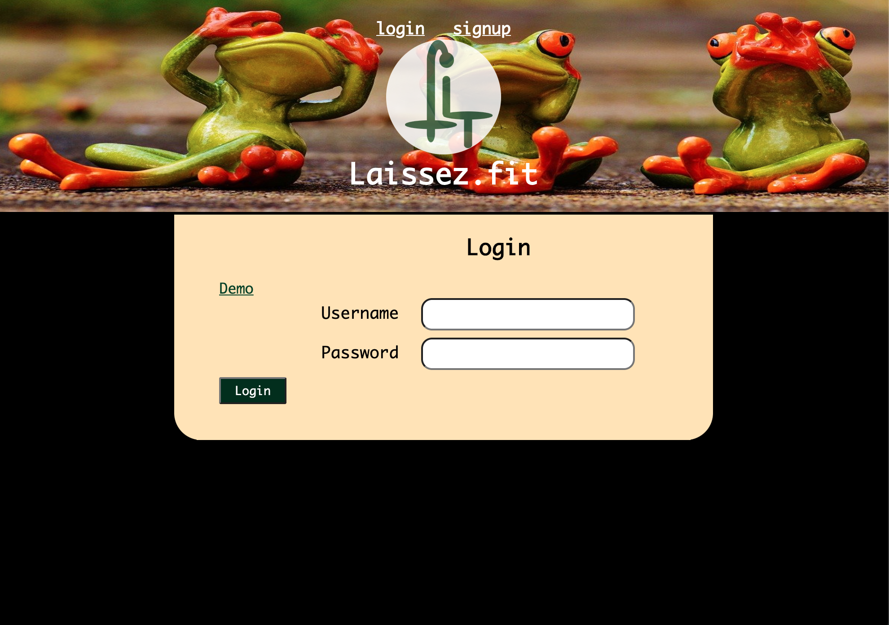
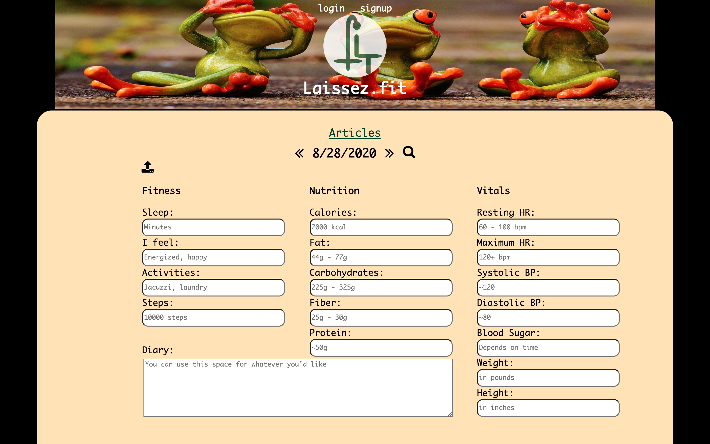
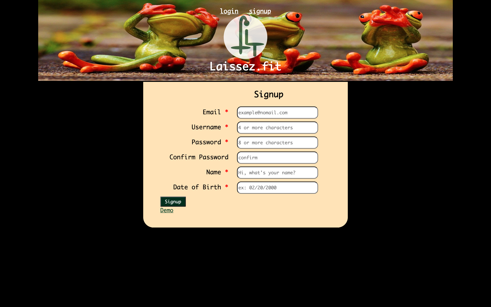

# Laissez.fit Client

For testing, use the :closed_lock_with_key: username: test01 and password: tester01 for testing

# Live App

:zap: https://laissez-fit-client.vercel.app/ :zap:

## Introduction

This site is dedicated to lazy fitness. The idea is that we live in a lazy world
and if we would do things differently, we might be healthier without all the 
work that we generally associate with getting healthier.

## Usage

You can track your metrics or learn about lazy ways to improve your fitness 
with Laissez.fit. You can log sleep, mood, activities, steps and diary. You can
track your vital statistics, that means blood sugar, resting heart rate, 
maximum heart rate, blood pressure, weight and even height. You can update your 
macro nutrients and calories throughout the day as well. Each time you update the values, the old values will disappear. For example, if today, you logged your maximum heart rate at 9 am and it was 124, then at 3pm you found it was 145, when you update it to 145, the old value of 124 is gone. 

:1234:	- The tracking endpoint is setup to take numbers for the numerical data points, but will take and remove values with non-numerical characters. When the user retrieves their data, the non-numerical characters will have been removed.

:arrows_counterclockwise:  - Reloading will logout the user. For that, Navigation is very simple. There are 4 screens, outside of the login and signup pages. These include Tracking and Articles. Articles is a list of titles, which can be opened, each of which includes navigation to add a comment on the comment page.

:white_check_mark:  - Previously submitted days are updated with a PATCH request, which are otherwise submitted with a POST request.

:left_speech_bubble:  - There is a comment component is to add a comment, while the comments component displays the comments of a chosen article.

The endpoints to the API are users, tracking, articles and comments.

## Stack

React/JS/JSX/JSON

## Screenshots

